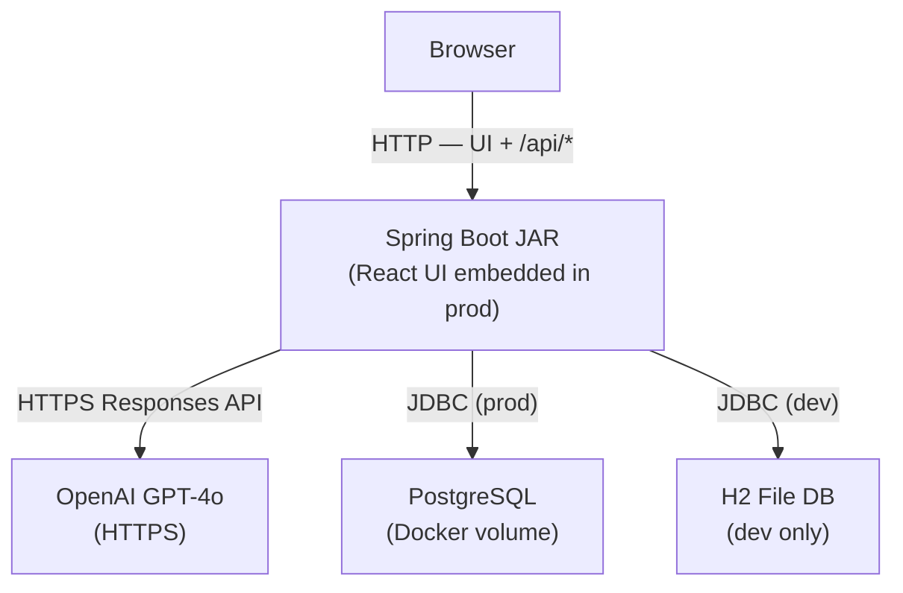

# AI QA Assistant

> Built with Spring Boot, OpenAI GPT-4o, React, and H2/PostgreSQL. Converts a feature description into a comprehensive, structured test plan — including functional tests, edge cases, API tests, automation skeletons (TestNG + Playwright), risk analysis, and confidence scoring. All plans are saved to a database and exportable as Markdown or PDF.

## Architecture



---

## Prerequisites

- Java 21
- Maven 3.x
- Node.js 20+
- An OpenAI API key with a funded balance ([platform.openai.com/settings/billing](https://platform.openai.com/settings/billing))
- Docker + Docker Compose (for production deployment)

---

## Environments

| Concern | Dev | Prod |
|---------|-----|------|
| Database | H2 file-based (`./data/tcgen`) | PostgreSQL (Docker container) |
| H2 console | Enabled at `/h2-console` | Disabled |
| CORS | Allowed from `localhost:5173` | Disabled (same origin) |
| Frontend | `npm run dev` (port 5173) | Embedded inside the Spring Boot jar |
| Activate | Default | `mvn -Pprod` or `SPRING_PROFILES_ACTIVE=prod` |

---

## Running in development

### 1. Start the backend

```powershell
# PowerShell
$env:OPENAI_API_KEY = "sk-..."
mvn spring-boot:run
```

```bash
# Bash / macOS / Linux
export OPENAI_API_KEY="sk-..."
mvn spring-boot:run
```

The API starts on `http://localhost:8080` using the `dev` profile (H2 database) by default.

### 2. Start the frontend

```bash
cd frontend
npm install   # first time only
npm run dev
```

Open `http://localhost:5173`.

### H2 console (dev only)

Open `http://localhost:8080/h2-console`:
- JDBC URL: `jdbc:h2:file:./data/tcgen`
- Username: `sa`  Password: *(leave blank)*

---

## Running with Docker (production)

### 1. Create your `.env` file

```bash
cp .env.example .env
# Edit .env and fill in OPENAI_API_KEY, DB_USER, DB_PASSWORD
```

### 2. Start everything

```bash
docker compose up --build
```

This will:
1. Build the Spring Boot jar with the React UI embedded (Maven `prod` profile)
2. Start a PostgreSQL container with a persistent volume
3. Start the app container, wired to the database

Open `http://localhost:8080`. Everything is served from a single port.

### 3. Stop

```bash
docker compose down          # keeps the database volume
docker compose down -v       # also deletes the database
```

---

## Sample input / output

**Request:**
```json
{
  "feature": "As a user, I want to log in using my email and password, then verify my identity with a one-time code sent to my phone"
}
```

**Response:**
```json
{
  "summary": "A login flow with MFA that authenticates users via email/password and a phone-based OTP.",
  "testCases": [
    "Verify successful login with valid credentials and correct OTP",
    "Verify OTP is sent to the registered phone number after correct password entry",
    "Verify session is created and user is redirected after MFA success"
  ],
  "edgeCases": [
    "Submit OTP exactly at the expiry boundary (e.g. 29 seconds vs 30 seconds)",
    "Login from a new device triggers step-up authentication",
    "Phone number with international dialling code receives OTP"
  ],
  "negativeTests": [
    "Enter incorrect OTP three times — verify account lockout",
    "Submit expired OTP — verify rejection with informative error",
    "Leave OTP field blank and submit — verify validation message"
  ],
  "securityTests": [
    "Attempt OTP enumeration by submitting all 6-digit combinations via API",
    "Replay a previously used OTP — verify it is rejected",
    "Intercept and modify the OTP delivery channel via a MITM proxy"
  ],
  "apiTests": [
    "POST /auth/login returns 200 with valid credentials",
    "POST /auth/mfa/verify returns 401 with expired OTP",
    "POST /auth/login returns 429 after 5 failed attempts within 1 minute"
  ],
  "automationSkeleton": "@Test\npublic void testMfaLogin() {\n    Response loginRes = given().body(loginPayload).post(\"/auth/login\");\n    assertEquals(200, loginRes.statusCode());\n    String otp = fetchOtpFromTestSms();\n    Response mfaRes = given().body(Map.of(\"otp\", otp)).post(\"/auth/mfa/verify\");\n    assertEquals(200, mfaRes.statusCode());\n}",
  "playwrightSkeleton": "test('MFA login', async ({ page }) => {\n  await page.goto('/login');\n  await page.fill('#email', 'user@example.com');\n  await page.fill('#password', 'secret');\n  await page.click('button[type=submit]');\n  const otp = await fetchTestOtp();\n  await page.fill('#otp', otp);\n  await page.click('#verify-btn');\n  await expect(page).toHaveURL('/dashboard');\n});",
  "riskLevel": "High",
  "confidenceScore": 0.9
}
```

---

## API reference

### Generate a test plan

**`POST /api/tests/generate`** — `Content-Type: application/json`

### Get generation history

**`GET /api/tests/history`** — returns all runs, newest first

### Export a test plan

**`GET /api/tests/export/{id}`** — downloads `.md` file

**`GET /api/tests/export/{id}/pdf`** — downloads `.pdf` file

### cURL example

```bash
curl -X POST http://localhost:8080/api/tests/generate \
  -H "Content-Type: application/json" \
  -d '{"feature": "As a user, I want to reset my password using my email"}'
```

---

## Reliability guardrails

Each generation goes through up to **3 attempts**:

1. First call to OpenAI with the feature description
2. On validation failure — fix prompt sent with the bad JSON
3. On third failure — hardcoded fallback response returned

Each successful response is **validated** (all 9 fields present, arrays non-empty, risk level valid) and assigned a **confidence score** (0.0–1.0).

---

## Error responses

| Status | Cause |
|--------|-------|
| 400 | `feature` is blank or missing |
| 415 | Missing `Content-Type: application/json` |
| 500 | OpenAI returned unparseable response after retries |

---

## Project structure

```
├── Dockerfile                                 Two-stage prod build (Maven + JRE)
├── docker-compose.yml                         Runs app + PostgreSQL together
├── .env.example                               Template for required env vars
├── pom.xml                                    Maven — dev (default) and prod profiles
│
├── src/main/
│   ├── java/com/example/aitestgenerator/
│   │   ├── AiTestGeneratorApplication.java
│   │   ├── config/CorsConfig.java             CORS — driven by properties, off in prod
│   │   ├── controller/
│   │   │   ├── TestCaseController.java        POST /api/tests/generate
│   │   │   └── HistoryController.java         GET history + export endpoints
│   │   ├── service/
│   │   │   ├── OpenAiService.java             Calls OpenAI Responses API
│   │   │   ├── TestCaseGenerationService.java Retry loop, validation, confidence scoring
│   │   │   ├── ValidationService.java         Validates all 9 response fields
│   │   │   └── HistoryService.java            Saves runs, Markdown + PDF export
│   │   ├── model/
│   │   │   ├── TestCaseRequest.java
│   │   │   ├── TestCaseResponse.java          9 fields + confidenceScore
│   │   │   ├── TestRun.java                   JPA entity
│   │   │   └── ValidationResult.java
│   │   ├── repository/TestRunRepository.java
│   │   └── exception/GlobalExceptionHandler.java
│   └── resources/
│       ├── application.properties             Shared (OpenAI, port, logging)
│       ├── application-dev.properties         H2 + CORS for local dev
│       └── application-prod.properties        PostgreSQL, no CORS
│
├── frontend/
│   ├── .env.development                       VITE_API_BASE → localhost:8080
│   ├── .env.production                        VITE_API_BASE → /api/tests (relative)
│   └── src/
│       ├── App.jsx
│       ├── api.js
│       └── components/
│           ├── GeneratorForm.jsx
│           ├── ResultPanel.jsx
│           ├── HistoryList.jsx
│           ├── ExportButton.jsx
│           └── Tooltip.jsx
│
├── src/test/                                  33 unit tests across 4 service classes
└── Docs/
    ├── Plans/PLAN-PHASE1–4.md
    └── Requirements/Phase 1–4.docx
```

---

## Configuration reference

### Backend

| Property | Profile | Description |
|----------|---------|-------------|
| `openai.api-key` | all | Set via `OPENAI_API_KEY` env var |
| `openai.model` | all | Default: `gpt-4o` |
| `server.port` | all | Default: `8080` |
| `spring.datasource.url` | dev/prod | H2 file or PostgreSQL JDBC URL |
| `spring.h2.console.enabled` | dev | Web console at `/h2-console` |
| `cors.allowed-origins` | dev | Empty in prod (same-origin) |

### Frontend

| Variable | Dev | Prod |
|----------|-----|------|
| `VITE_API_BASE` | `http://localhost:8080/api/tests` | `/api/tests` |
